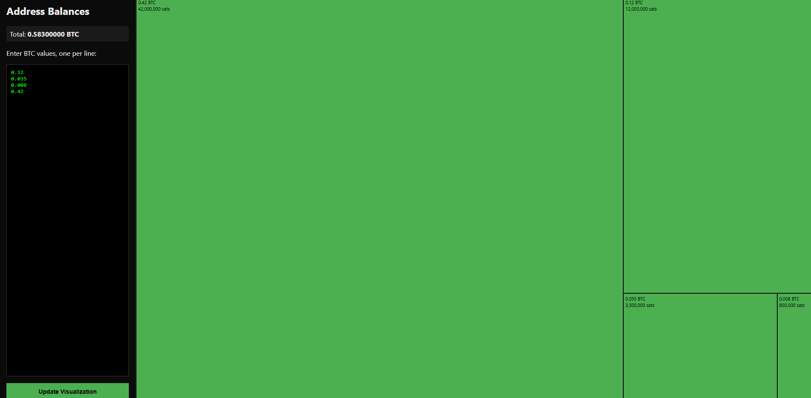

# BTC visualizer

A small visualizer where you can enter your sats/btc value per address
to get a visual overview over the size. Can be handy when figuring what and 
when to consolidate! 

# Note

Please due note that entering and publishing your actual btc amounts can
be used to detect your identity so never expose exact amounts!

# how to run?

1. have python installed 
2. go to the project folder in the terminal after git-cloning
3. `python3 -m http.server 8000` and go to your browser localhost:8000